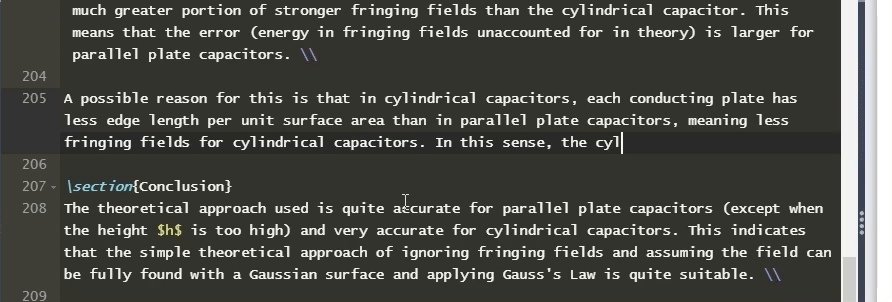
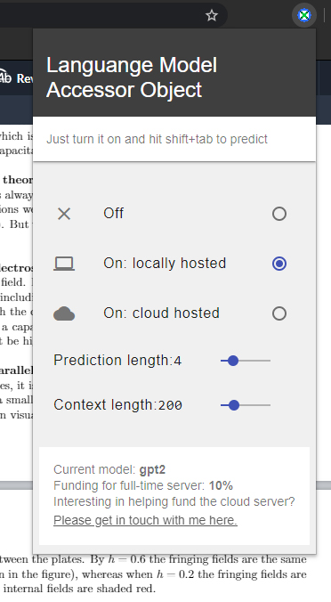

# LMAO - Language model accessor object
What? A chrome extension that adds a neural auto-complete function to LaTeX documents in any Overleaf project. Concretely, it is a GPT2 language model server which hooks into Overleaf's editor to add 'gmail smart compose' or '[write with transformer](https://transformer.huggingface.co/)'-like functionlity, but for LaTeX and it works seamlessly on top of Overleaf's editor :).

Some more info:
- Works with all existing Overleaf setups (all color themes, existing hotkeys...)
- Autocompletes the next few words given the historical context in the current document.
- Here is what some of the predictions look like in the editor:

**STATUS UPDATE Feb 2021: on haitus**. Please get in contact if you would like to help test out the extension or take the project further. Due to time and other constraints, I haven't been able to continue development of this project. Following the rest of this readme might not work exactly as some libraries have been updated and API calls have changed, so you might need to fiddle around to get things to work. Nevertheless, it is still quite fun once one gets it working, and if anyone wants to continue work on it feel free to fork the repo or just see how I've done things.

## TL;DR: how it works
A chrome extension interfaces with Overleaf to, whenever a certain hotkey is pressed, send an HTTPS request to an external inference server (running the GPT2 model) passing along the recent text history around the cursor. The server then returns a few predictions for the next few words, and the chrome extension adds these as autocompletions in the Overleaf editor. [Feel free to read more about it, and how the GPT2 models were fine-tuned here](https://rf5.github.io/2019/12/09/lmao-overleaf.html).

This external server can either be a local python Django server or the external cloud server that I would like to host. Currently only the local option is available until I find enough funds to host a persistent GPU server (as any CPU instance takes waaay to long for autocompletes). If you are in a position to help fund this project, please get in [contact with me here](https://rf5.github.io/about.html).

Note: this project is in no way associated with Overleaf or their team. It's just a cool extension that hooks into Overleaf because their service and editor is quite nice.

### Customization
The various settings of LMAO can be adjusted by clicking on the icon when in Overleaf, which brings up a menu that looks something like

The settings are:
- **Prediction length** is the number of words to auto-complete for each prediction. i.e a value of 4 means that predictions for the next 4 words will be generated. Extremely high values of this may increase prediction times a little.
- **Context length** is the number of words before the current cursor position to use as historical context to condition the text generation on. So a value of 200 means "use the last 200 words to predict the next word". Extremely high values of this may increase prediction times a little (still <800ms even at 600 words with a GPU).

## Installation
Simply go to the Google chrome web store and navigate to this extension and hit 'install'. Then next time you go to an overleaf project, click the icon and it should be pretty obvious what to do :). 

## Setting up python Django server for local inference
If you have a reasonable Nvidia GPU and have python installed, then you can host the server locally with django! So, in addition to getting the chrome extension, you need to:
- Clone this repo
- Create a new python environment (3.6 or newer)
- Open a new terminal with the new python environment activated, cd into `lmao/` folder.
- Install pip requirements (`pip install -r requirements.txt`). You might need to run a separate command to install pytorch correctly on your system. See [Pytorch's installation guide for more info](https://pytorch.org/get-started/locally/).
- Create a folder in this directory called `models/`. Download the GPT2 model/config zip file `gpt2-small.zip` under the 'Releases' tab and extract it into the `models/` folder. So now there should be a `lmao/models/gpt2-small` folder.
- Now run `python manage.py runserver`. It should start up the server and just idle in the background. Leave this terminal running while you are using the extension on Overleaf. If you want to run the local server again, just start up the terminal and activate your python environment, and run `python manage.py runserver` again. PS: you might need to run `python manage.py migrate` the first time you try run the server, depending on the Django version.

## Setting up cloud hosting on AWS
Don't worry, only I need to do this. Currently just trying to gather enough funds for a persistent GPU inference server.

## Current leads
- Aquire funding for GPU cloud server.
- Allow custom hotkey setup for inference
- Allow inference if user does not type for a certain number of seconds
- Train and use bigger GPT2 models for better predictions + get more quality LaTeX source files to train on.

## Past explored leads:
- [Links to host the model with GPU support](https://pytorch.org/blog/model-serving-in-pyorch/)
- find where `base` of `editor.completer.base` is set during each call.... It defines the start position of the prefix (where the last '\' is ). 
- Alternatively, try find a way to change the prefix behavior calculation. See line 1508/1542 of ext-language-tools.

## Known bugs
- ~~Does not work so well if large portions of the document are commented out.~~ Fixed.
